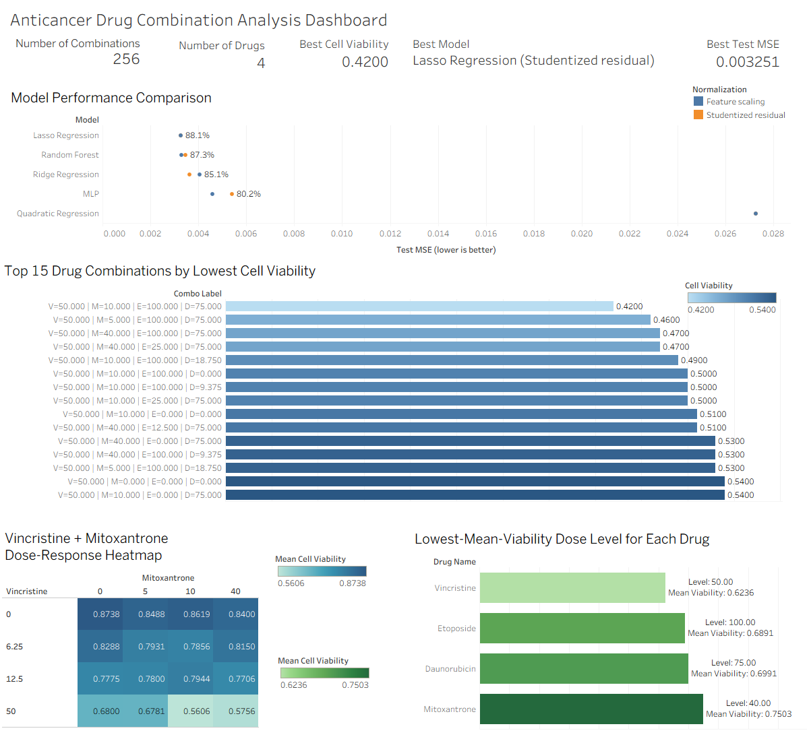

# Statistical Analysis of Anticancer Drug Combinations

This repository packages a course project as a reproducible data-science case study. The project analyzes how combinations of **Vincristine**, **Mitoxantrone**, **Etoposide**, and **Daunorubicin** affect leukemia cell viability using statistical learning in **R**, then extends the analysis into a **PostgreSQL** database layer and a **Tableau** dashboard for portfolio-ready exploratory analysis and reporting.

## Why this repo exists

The original project folder contained useful work, but it was not GitHub-ready: duplicated scripts, hidden R workspace files, course materials mixed with source code, and filenames that did not clearly communicate purpose. This version reorganizes the project into a portfolio-friendly structure that is easier for recruiters, hiring managers, and collaborators to understand.

This repository now presents the project as an **end-to-end analytics workflow**:
- **R** for modeling and statistical analysis
- **PostgreSQL** for structured storage and dashboard-facing analytical views
- **Tableau** for interactive visualization and business-style reporting

## Project highlights

- Built models on **256 dosage combinations** of four anticancer drugs with **14 engineered features** (4 dosage terms + 10 interaction/quadratic terms).
- Compared **quadratic regression, ridge regression, lasso regression, multilayer perceptron, and random forest** under both **feature scaling** and **studentized-residual normalization**.
- Used **8-fold cross-validation**, test-set **MSE**, and repeated random holdout evaluation to compare model quality and stability.
- Found that **Lasso** and **Random Forest** were the strongest-performing models, with test MSE around **0.00325-0.00330** versus **0.02725** for quadratic regression.
- Identified **Vincristine-based combinations**, especially **Vincristine + Mitoxantrone (VM)**, as the most promising combinations for reducing leukemia cell viability, while also surfacing a caution that excessive Mitoxantrone may reduce efficacy.
- Built a **PostgreSQL schema and analytical views** to support downstream BI workflows.
- Designed a **Tableau dashboard** summarizing KPI metrics, model performance, top-performing combinations, VM dose-response patterns, and best dose levels by drug.

## Tech stack

- **R**: statistical modeling, feature engineering, cross-validation, resampling
- **PostgreSQL**: relational schema design, analytical views, dashboard data serving
- **Tableau**: dashboarding and visual analytics
- **Git/GitHub**: portfolio packaging and version control

## Repository structure

```text
drug-combination/
├── README.md
├── .gitignore
├── data/
│   ├── README.md
│   ├── raw/
│   │   └── drug_viability_data.csv
│   └── processed/
│       └── README.md
├── database/
│   ├── README.md
│   ├── schema/
│   │   └── 00_full_setup.sql
│   ├── queries/
│   │   └── validation_queries.sql
│   └── erd.md
├── docs/
│   ├── portfolio_summary.md
│   └── script_map.md
├── reports/
│   ├── final_report.pdf
│   └── progress_report.pdf
├── results/
│   └── design_pdfs/
├── slides/
│   ├── project_presentation.pptx
│   ├── design_16_results.pptx
│   └── design_32_results.pptx
├── src/
│   ├── setup_packages.R
│   ├── modeling/
│   └── design/
└── tableau/
    ├── README.md
    ├── dashboard.png
    ├── dashboard.pdf
    └── workbook/
        └── README.md
```

## Dashboard preview



## Quick start

### R analysis
1. Open an R session in the repository root.
2. Install dependencies:
   ```r
   source("src/setup_packages.R")
   ```
3. Run a core analysis script, for example:
   ```r
   source("src/modeling/feature_scaling_models.R")
   ```

### PostgreSQL setup
1. Create a PostgreSQL database, for example `drug_combo`.
2. Run the schema-and-view setup script:
   ```bash
   psql -d drug_combo -f database/schema/00_full_setup.sql
   ```
3. Optionally run the validation queries:
   ```bash
   psql -d drug_combo -f database/queries/validation_queries.sql
   ```

### Tableau dashboard
1. Open Tableau and connect to the PostgreSQL database.
2. Use the prepared views in the `drug_combo` schema:
   - `vw_dashboard_kpis`
   - `vw_model_performance`
   - `vw_top_combinations`
   - `vw_vincristine_mitoxantrone_heatmap`
   - `vw_best_drug_levels`
3. Review `tableau/README.md` for the worksheet-by-worksheet build notes and asset checklist.

## Suggested entry points

### Modeling
- `src/modeling/feature_scaling_models.R` - main comparison under feature scaling
- `src/modeling/studentized_residual_models.R` - main comparison under studentized residual normalization
- `src/modeling/stability_resampling.R` - repeated holdout experiment used to assess model stability

### Experimental design
- `src/design/search/` - scripts used to construct 16-point and 32-point candidate designs
- `src/design/evaluation/` - scripts that evaluate design candidates against the full dataset or held-out combinations

### SQL / BI
- `database/schema/00_full_setup.sql` - full PostgreSQL setup for tables and dashboard-facing views
- `database/queries/validation_queries.sql` - quick checks for validating schema contents and views
- `database/erd.md` - schema diagram and table relationships
- `tableau/dashboard.png` - exported dashboard preview used in this README
- `tableau/dashboard.pdf` - static PDF export of the dashboard
- `tableau/workbook/README.md` - where to place the `.twb` or `.twbx` workbook export

## Main analytical views for Tableau

The PostgreSQL layer exposes pre-aggregated views for dashboarding:

- `drug_combo.vw_dashboard_kpis` - overall project KPI summary
- `drug_combo.vw_model_performance` - model-level performance comparison
- `drug_combo.vw_top_combinations` - lowest-viability combination ranking
- `drug_combo.vw_vincristine_mitoxantrone_heatmap` - VM pair dose-response heatmap data
- `drug_combo.vw_best_drug_levels` - best-performing dose level summary by drug

## Key findings

- **Lasso Regression** and **Random Forest** consistently outperformed quadratic regression and other baselines.
- **Vincristine-based combinations** were the strongest overall candidates for lowering leukemia cell viability.
- **Vincristine + Mitoxantrone** emerged as a particularly strong pair in both model-guided interpretation and dashboard-level exploratory analysis.
- The SQL + Tableau extension makes the project easier to inspect interactively and positions it as a complete analytics workflow rather than a scripts-only modeling exercise.

## Portfolio framing

This repository is intended to demonstrate the ability to:
- clean and reorganize an academic project into a professional GitHub repository
- perform statistical modeling and model comparison
- design a relational SQL layer for downstream analytics
- build a Tableau dashboard that communicates model and treatment-combination insights clearly
