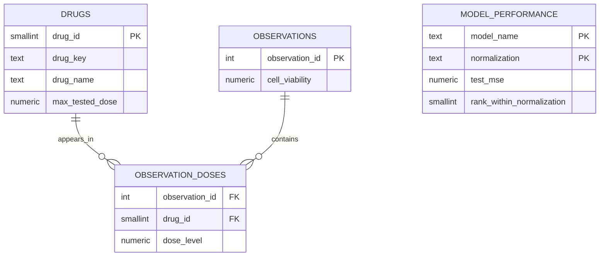

# Entity relationship diagram

## Notes

- `observations` stores the experiment-level outcome.
- `observation_doses` normalizes the four dose columns into a long bridge table.
- `drugs` supplies the metadata needed for pivots, summaries, and Tableau filters.
- `model_performance` stores the reported benchmark metrics used in the model-comparison chart.
- The Tableau views in `00_full_setup.sql` sit on top of this compact schema and avoid doing heavy reshaping inside Tableau.
